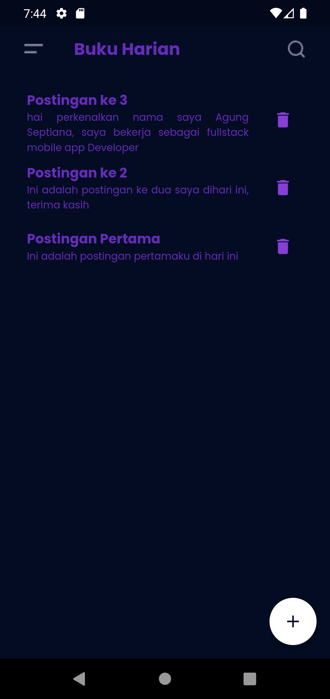

# harian_flutter

A new Flutter project with Serverpod.

## Getting Started

This project is a starting point for a Flutter application that is using
Serverpod.

A great starting point for learning Serverpod is our documentation site at:
[https://docs.serverpod.dev](https://docs.serverpod.dev).

To run the project, first make sure that the server is running, then do:

    flutter run

